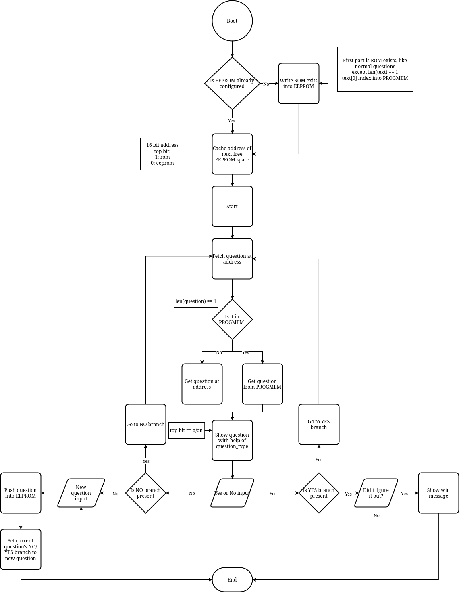

# Arduino barkochba game

Made for a friend's birthday with an Arduino Nano.

`Barkochba` (or Barkóba) is a hungarian version of "Twenty Questions", which has no question limit.

Uses `PROGMEM` and `EEPROM` to store more questions. `EEPROM` is used for questions made by users.

## How to Use
1. Upload the code to an Arduino UNO/Nano (others should work too) using the Arduino IDE or VSCode extension.
1. Open the serial monitor (use 9600 baud if you haven't modified the code).
1. Answer questions with `yes` or `no`.
1. At the end of the game, you'll be prompted to input your own question (if you want to).

## Flowchart of logic

## Bitfields
- `Address`: 15\. bit = `PROGMEM`(0) / `EEPROM`(1) switch
- `questionTag`: 7. bit = insert a/an before `text`

## Question formats
### Normal question
1. `text`: \0 ended string (1-51 byte)
1. `yesAddress`: address for `YES` branch (2 byte)
1. `noAddress`: address for `NO` branch (2 byte)
1. `questionTag`: index into `QUESTION_TAGS` (1 byte)

### Exit question
Each path must exit from `PROGMEM` into `EEPROM`, so that users can expand them.  
So to save `EEPROM` space, exit question texts are stored in `EXIT_TEXTS` and are indexed by `text[0]`.  
These are stored from the start of EEPROM until `len(ROM_EXIT_QUESTIONS) * 7 - 1` byte (7 byte is the size of 1 exit question).

1. `text`: [<EXIT_TEXTS index>, '\0'] (2 byte)
1. `yesAddress`: address for `YES` branch (2 byte)
1. `noAddress`: address for `NO` branch (2 byte)
1. `questionTag`: index into `QUESTION_TAGS` (1 byte)

 

Makefile ~~stolen~~ borrowed from [Marlin 3D Printer Firmware](https://github.com/MarlinFirmware/Marlin)'s [makefile](https://github.com/MarlinFirmware/Marlin/blob/2.1.x/Marlin/Makefile) (use arduino IDE or vscode extension instead if you can)